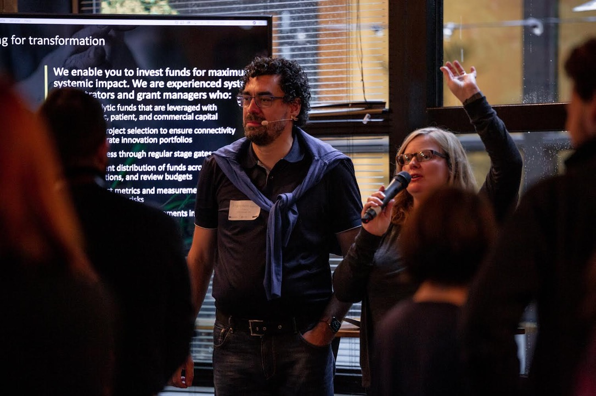

import imageFranciscoBaptista from '@/images/francisco-baptista.jpg'

export const article = {
  date: '2024-09-12',
  title: 'The Executive Paradox: Why Smart Leaders Make Poor Decisions Under Pressure',
  description:
    'Neuroscience reveals why high-performing executives often struggle most with decision-making when stakes are highest. Here\'s how to lead from centeredness instead of reactivity.',
  author: {
    name: 'Francisco Baptista',
    role: 'Senior Executive Coach',
    image: { src: imageFranciscoBaptista },
  },
}

export const metadata = {
  title: article.title,
  description: article.description,
}

Last month, I worked with a pharmaceutical CEO who made a $50M acquisition decision in 20 minutes but spent three weeks agonizing over which presentation slide to lead with at a board meeting.

Sound familiar? There's a neuroscientific reason why brilliant executives often struggle most with decisions when the stakes feel highest—and it's not what you think.

## The Pressure Paradox

**Counter-intuitive truth:** The more pressure you feel, the less access you have to your best decision-making capabilities.

Here's what happens in your brain during high-stakes moments:

1. **Amygdala activation** floods your system with stress hormones
2. **Prefrontal cortex** (your executive functioning center) goes offline
3. **Ancient survival patterns** take over: fight, flight, or freeze

You end up making crucial decisions from your most reactive, least wise state.

## Why Traditional Pressure Management Fails

Most executive training focuses on stress management: "Take deep breaths," "Think rationally," "Use decision-making frameworks."

**The problem:** These approaches assume you have access to rational thinking when you're already in a triggered state. But neuroscience shows that once your amygdala is activated, rational advice is like shouting instructions at someone who's underwater.

## The Inner Team Under Pressure

Here's what actually happens inside when you're facing a high-stakes decision:

Your **Perfectionist** screams: *"We need more data! What if we're missing something critical?"*

Your **People-Pleaser** panics: *"What will the board think? How do we make everyone happy?"*

Your **Critic** attacks: *"Remember the last time you made a call like this? What if you're wrong again?"*

Your **Driver** demands: *"Just pick something! We're running out of time!"*

Meanwhile, your **authentic Leader**—the part of you that makes wise, centered decisions—gets drowned out by the noise.

## The Centeredness Solution

The most effective executives I work with have learned to make decisions from what I call **conscious centeredness** rather than unconscious reactivity.

This isn't about eliminating pressure or inner conflict—it's about developing **Inner Team Dynamics™** mastery so you can access your wisest self even in challenging moments.

### Real Example: Tech CEO Crisis Decision

**Situation:** Major security breach discovered 6 hours before IPO roadshow launch.

**Reactive response:** CEO's inner Perfectionist wanted to delay everything for more security audits. People-Pleaser wanted to minimize the issue to protect investor relations. Critic obsessed over how this would reflect on his leadership.

**Centered response:** CEO took 10 minutes to acknowledge each part's concerns, then asked his authentic Leader: *"What serves the company's long-term integrity?"* 

**Decision:** Proactive disclosure to investors with clear remediation plan. IPO proceeded successfully with enhanced credibility.

## Three Practices for Pressure-Proof Decision Making

### 1. The 90-Second Pause
When you feel pressure spiking, take 90 seconds to let your nervous system recalibrate. This isn't "wasting time"—it's investing in decision quality.

**Practice:** Notice physical pressure signals (tight chest, shallow breathing, racing thoughts). Acknowledge them: *"My system is activated. This is information, not direction."*

### 2. Inner Team Check-In
Ask yourself: *"Which part of me wants to lead this decision?"* 

- **Perfectionist leading:** Usually creates analysis paralysis
- **People-Pleaser leading:** Often compromises core values  
- **Critic leading:** Focuses on avoiding failure rather than creating success
- **Driver leading:** May sacrifice quality for speed
- **Authentic Leader leading:** Integrates all perspectives while staying connected to deeper purpose

### 3. The Clarity Question
Before any high-stakes decision, ask: *"What would I choose if I were operating from my wisest, most centered self?"*

This isn't about having the "right" answer immediately—it's about accessing the part of you that's capable of wise discernment under pressure.

## Why This Approach Works

When you learn to lead from centeredness instead of reactivity:

- **Decision speed increases** (less second-guessing)
- **Decision quality improves** (access to broader perspective)
- **Team confidence grows** (they feel your grounded presence)
- **Personal energy sustains** (less internal conflict means less depletion)

## The Leadership Edge

In our hyper-accelerated business environment, the ability to remain centered under pressure isn't just a nice-to-have—it's a competitive advantage.

Executives who can access their authentic Leader in high-stakes moments don't just make better decisions. They create the psychological safety that allows their teams to perform at their best when it matters most.

## Your Next High-Stakes Decision

The next time you're facing a pressure-filled decision, try this experiment:

1. **Pause** long enough to let your nervous system settle
2. **Acknowledge** which parts of you are most activated  
3. **Ask** your centered Leader what serves the highest good
4. **Decide** from that place of integration

You might be surprised how much clarity becomes available when you stop fighting the pressure and start conducting your inner orchestra instead.

---

*Want to develop unshakeable decision-making under pressure? Start with an Executive Discovery Call where we'll explore your specific patterns and create practices tailored to your leadership context.*
