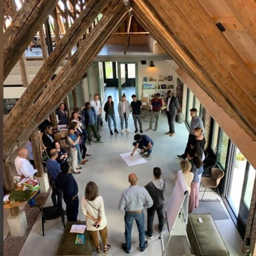
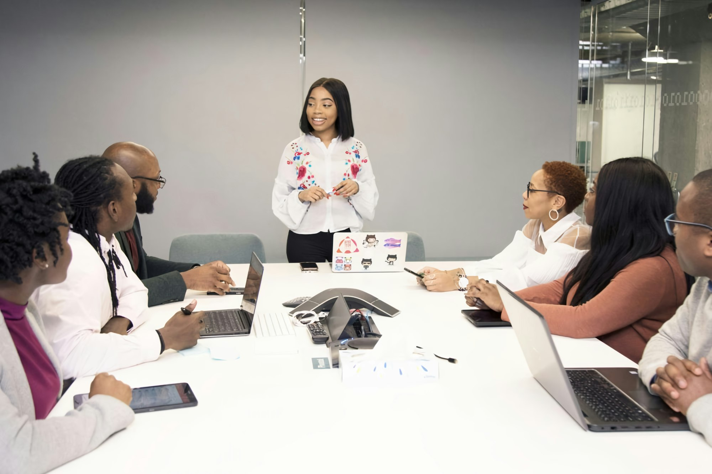

import imageFranciscoBaptista from '@/images/francisco-baptista.jpg'

export const article = {
  date: '2024-10-28',
  title: 'How AI Is Transforming Executive Coaching (And Why It Matters)',
  description:
    'My MIT certification in AI for business revealed how machine intelligence can illuminate leadership blind spots that traditional coaching methods miss. Here\'s what every executive should know.',
  author: {
    name: 'Francisco Baptista',
    role: 'Senior Executive Coach',
    image: { src: imageFranciscoBaptista },
  },
}

export const metadata = {
  title: article.title,
  description: article.description,
}

When I completed MIT's "Making AI Work: Machine Intelligence for Business and Society" certification, I wasn't expecting it to revolutionize how I approach executive coaching. But the intersection of human psychology and machine pattern recognition has opened possibilities I never imagined.

Here's how AI is changing the game for executive development—and why it matters for your leadership journey.

## The Blind Spot Problem

Every executive has blind spots. They're not character flaws—they're neurological inevitabilities. Your brain processes roughly 11 million bits of information per second but only brings about 40 bits to conscious awareness. 

Traditional coaching relies on self-reporting ("What triggers you in board meetings?") and behavioral observation ("I noticed you interrupted three times"). Both are valuable, but incomplete.

**The challenge:** You can't see the patterns you're inside of.

## What AI Actually Reveals

AI-enhanced coaching isn't about replacing human wisdom—it's about illuminating patterns that would take years to identify through traditional methods:

### 1. Communication Pattern Analysis
- **Traditional coaching:** "You seem defensive with certain stakeholders"
- **AI-enhanced insight:** "Your language complexity increases 340% and response time decreases by 60% specifically when discussing budget constraints with female CFOs—suggesting an unconscious trigger pattern"

### 2. Decision-Making Style Mapping  
- **Traditional coaching:** "Let's work on your decision-making process"
- **AI-enhanced insight:** "You consistently delay decisions when data confidence is between 70-85%, but move quickly below 70% or above 85%—indicating a specific uncertainty zone that triggers your inner Perfectionist"

### 3. Team Dynamic Detection
- **Traditional coaching:** "There seems to be tension in your leadership team"
- **AI-enhanced insight:** "Meeting engagement drops 45% when you use strategy-focused language vs. people-focused language, with three team members showing specific response patterns that suggest different motivational triggers"

## The Inner Team Dynamics™ + AI Combination

Here's where it gets powerful. AI excels at pattern recognition, but humans excel at meaning-making. When you combine AI insights with Inner Team Dynamics™ framework:

**Example:** AI identifies that your stress indicators spike 20 minutes before every board presentation. Traditional coaching might focus on presentation skills. 

**Inner Team Dynamics™ + AI approach:** We discover your inner Perfectionist is activated by the 20-minute warning, which then triggers your inner Critic ("What if they find the flaw in slide 12?"), which activates your People-Pleaser ("Maybe I should add more data to make everyone happy"), creating a cascade that leaves you exhausted before you even present.

**Solution:** Not better presentation skills, but conscious Inner Team conducting. Acknowledge the Perfectionist's protective intent, reassure the Critic with specific preparation rituals, and bring your authentic Leader forward.

## Three Ways AI Enhances Executive Coaching

### 1. Accelerated Self-Awareness
What used to take months of observation and reflection can be identified in weeks. This isn't shortcuts—it's precision.

### 2. Personalized Development Strategies  
Instead of generic leadership frameworks, AI helps create development approaches tailored to your specific patterns, triggers, and strengths.

### 3. Measurable Transformation
AI provides objective measures of change that go beyond subjective assessments. You can literally see your growth in data.

## The Human-AI Partnership

The most important insight from my MIT work: **AI amplifies human capabilities; it doesn't replace them.**

- **AI reveals** the pattern: "You interrupt colleagues 3x more frequently in meetings with external stakeholders"
- **Human wisdom interprets:** "Your Protector part is trying to control information flow when you feel exposed"  
- **Coaching transformation:** Conscious practices to let your authentic Leader conduct those moments instead

## What This Means for Your Leadership Development

If you're working with a coach who isn't incorporating some form of pattern recognition technology, you're likely missing insights that could accelerate your development significantly.

But be wary of coaching that's all tech and no humanity. The goal isn't to optimize you like a machine—it's to help you integrate all parts of yourself with unprecedented clarity and speed.

## The Future of Executive Development

We're moving from intuition-based coaching to insight-driven transformation. The executives who embrace this evolution won't just be more self-aware—they'll be more authentically powerful, more sustainably effective, and more genuinely themselves.

The question isn't whether AI will transform executive coaching. It already has. The question is: **Will you take advantage of it?**

---

*Ready to experience AI-enhanced executive coaching? Start with an Executive Discovery Call where we'll explore your specific patterns and possibilities. 30 minutes, completely confidential, no cost.*
