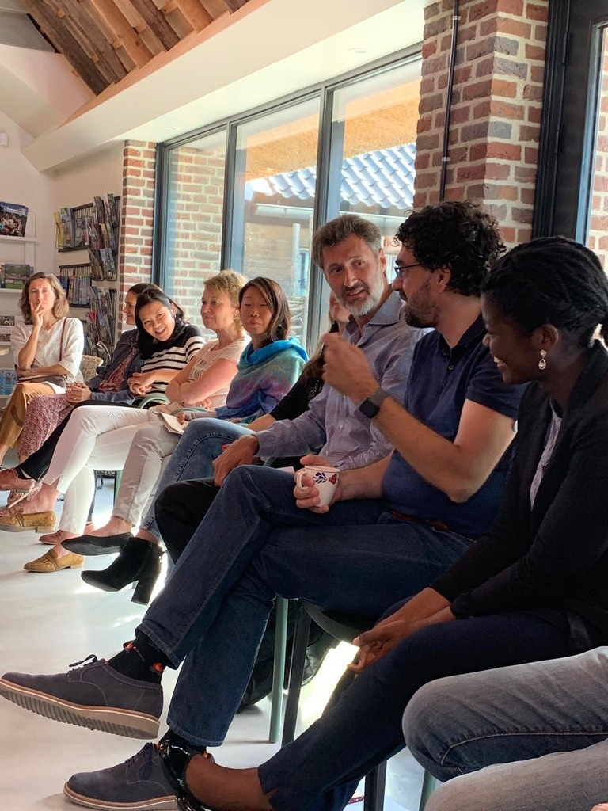
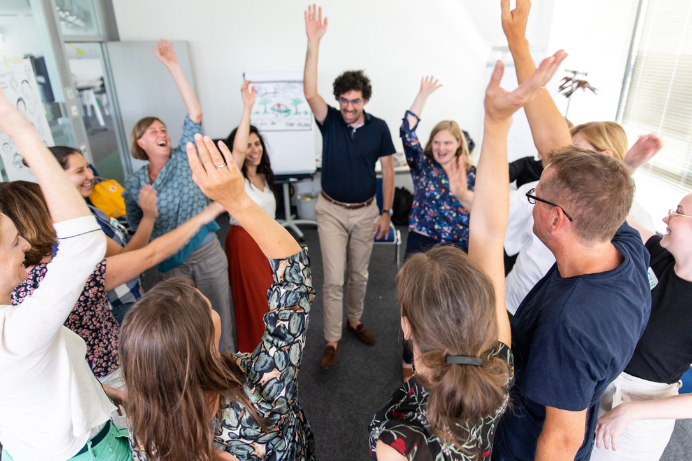

import imageFranciscoBaptista from '@/images/francisco-baptista.jpg'

export const article = {
  date: '2024-11-15',
  title: 'Why Traditional Leadership Development Fails Executives',
  description:
    'After working with 200+ senior leaders across 15+ countries, I\'ve discovered why most leadership development programs don\'t create lasting change—and what does.',
  author: {
    name: 'Francisco Baptista',
    role: 'Senior Executive Coach',
    image: { src: imageFranciscoBaptista },
  },
}

export const metadata = {
  title: article.title,
  description: article.description,
}

Most executive leadership programs focus on external behaviors—communication frameworks, decision-making models, delegation strategies. You leave feeling informed, maybe even inspired. But six months later, you're back to the same patterns, facing the same internal conflicts that no framework seems to address.

Here's what I've learned working with executives from Fortune 500 companies to government leaders: **sustainable transformation happens from the inside out.**

## The Problem: We're Treating Symptoms, Not Causes

Traditional leadership development asks: *"How do we make this leader more effective?"*

But here's what actually happens in that C-suite meeting where you need to be decisive:

- Your **Strategist** part wants more data before deciding
- Your **Driver** part is impatient and wants to move fast  
- Your **Perfectionist** part sees flaws in every option
- Your **People-Pleaser** part worries about stakeholder reactions

Meanwhile, you're supposed to project confidence and clarity. The disconnect between your inner complexity and expected outer composure creates exhaustion, reactive leadership, and that nagging sense of being inauthentic.

## The Real Work: Inner Team Dynamics™

What if instead of fighting these different parts of yourself, you learned to conduct them like an orchestra?

This is the foundation of **Inner Team Dynamics™**—understanding that you have multiple, valid aspects of your personality that each serve important functions:

- The **Strategist** protects you from hasty decisions
- The **Driver** ensures things actually happen
- The **Perfectionist** maintains high standards
- The **People-Pleaser** preserves important relationships

The goal isn't to eliminate any "instrument." It's to develop **conscious conducting**—choosing which part leads in different situations.

## Why This Approach Works

In my practice, I've seen executives transform not by adding more external tools, but by developing mastery over their internal landscape:

**Sarah, pharmaceutical exec:** "I used to feel scattered in board meetings, like different parts of me were arguing. Now I consciously bring forward my Strategic Self for analysis and my Decisive Leader for final calls. The clarity is immediately apparent to everyone in the room."

**Marcus, tech leader:** "Understanding my inner team helped me stop exhausting myself trying to be the 'perfect' leader. I can authentically adapt my leadership style to what each situation needs."

## The MIT-Enhanced Difference

My approach combines this proven depth work with AI-enhanced pattern recognition from my MIT certification in "Making AI Work: Machine Intelligence for Business and Society."

We use technology not to replace human wisdom, but to illuminate blind spots you can't see from inside your own system. The AI helps identify patterns in your leadership triggers, decision-making styles, and team dynamics with unprecedented clarity.

## Beyond Individual Coaching

Once you understand your own inner team, you start seeing team dynamics differently. That "difficult" stakeholder? They might just be leading with a part that triggers your inner Critic. That innovative idea that keeps getting stalled? Your team's collective Perfectionist might be overriding their shared Visionary.

Inner Team Dynamics™ principles scale from personal leadership to organizational transformation.

## The Question Every Executive Should Ask

Most leadership development asks: *"What skills do I need to develop?"*

The more powerful question is: *"Who am I becoming as a leader, and how do I integrate all parts of myself in service of that vision?"*

This isn't about fixing what's broken. It's about awakening what's already there.

---

*If you're ready to move beyond surface-level leadership development, start with an Executive Discovery Call. 30 minutes, completely confidential, no cost. Three partnership spots available this quarter.*
